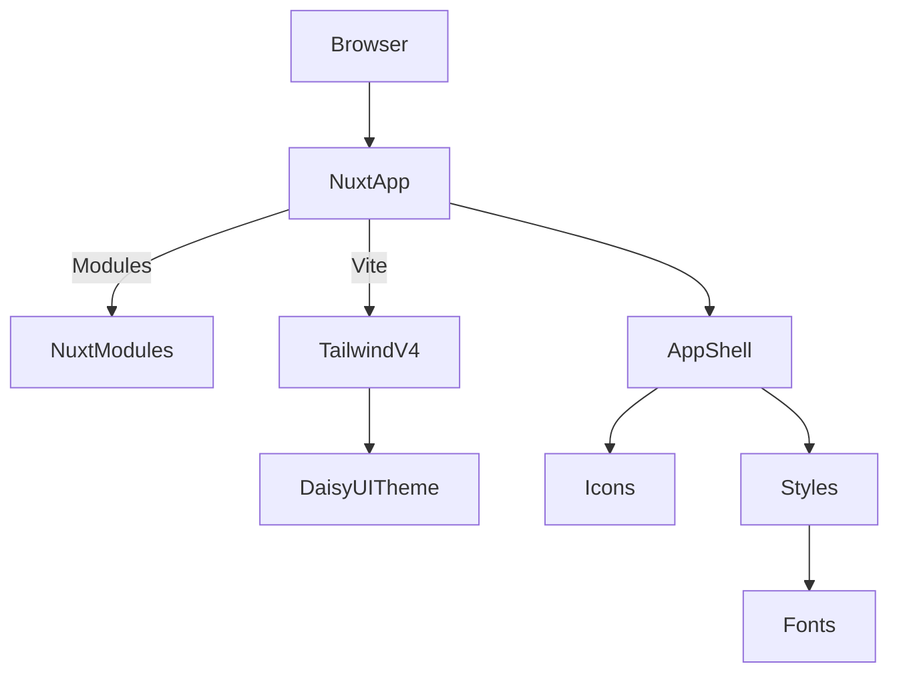

# Kira Starter — Project Overview

## Table of Contents
- [System Summary](#system-summary)
- [Tech Stack](#tech-stack)
- [Entry Points](#entry-points)
- [Subsystems](#subsystems)
- [High-Level Flow](#high-level-flow)
- [Architecture Summary](#architecture-summary)
- [Diagram](#diagram)
- [Glossary](#glossary)

## System Summary
Kira Starter is a minimal Nuxt 4 application focused on a modern, styled frontend. It integrates Tailwind CSS v4 via Vite, DaisyUI 5 for components and theming, local font loading, and Nuxt modules for icons and images. The current repository contains a single app shell with no backend or persistence.

## Tech Stack
- Framework: Nuxt 4 ([nuxt.config.ts](file:///Users/michaelnji/Projects/kira/nuxt.config.ts#L3-L25))
- Language: TypeScript 5.9 ([tsconfig.json](file:///Users/michaelnji/Projects/kira/tsconfig.json#L1-L18))
- UI: Vue 3, Tailwind CSS v4, DaisyUI 5 ([app.css](file:///Users/michaelnji/Projects/kira/app/assets/css/app.css#L1-L84))
- Modules: @nuxt/fonts, @nuxt/icon, @nuxt/image, @vueuse/nuxt, @formkit/auto-animate/nuxt ([nuxt.config.ts](file:///Users/michaelnji/Projects/kira/nuxt.config.ts#L10-L21))
- Tooling: ESLint (antfu config), Biome formatter, Simple Git Hooks, lint-staged ([package.json](file:///Users/michaelnji/Projects/kira/package.json#L28-L47), [eslint.config.mjs](file:///Users/michaelnji/Projects/kira/eslint.config.mjs#L1-L5), [biome.json](file:///Users/michaelnji/Projects/kira/biome.json#L1-L28))

## Entry Points
- Development server: `nuxt dev` ([package.json:scripts](file:///Users/michaelnji/Projects/kira/package.json#L5-L13))
- Build: `nuxt build`, Static generate: `nuxt generate`, Preview: `nuxt preview` ([package.json:scripts](file:///Users/michaelnji/Projects/kira/package.json#L5-L13))
- Application shell: [app.vue](file:///Users/michaelnji/Projects/kira/app/app.vue#L41-L253)
- Global styles and theme: [app.css](file:///Users/michaelnji/Projects/kira/app/assets/css/app.css#L1-L84)

## Subsystems
- App Shell: Composition API setup and hero/feature sections ([app.vue](file:///Users/michaelnji/Projects/kira/app/app.vue#L1-L253))
- Styling & Theme: Tailwind v4, DaisyUI theme “kira” ([app.css](file:///Users/michaelnji/Projects/kira/app/assets/css/app.css#L47-L84))
- Fonts: Local font-face declarations ([app.css](file:///Users/michaelnji/Projects/kira/app/assets/css/app.css#L3-L33))
- Icons: @nuxt/icon with Solar collection ([nuxt.config.ts](file:///Users/michaelnji/Projects/kira/nuxt.config.ts#L17-L21))
- Images: @nuxt/image (no usage in app shell yet) ([nuxt.config.ts](file:///Users/michaelnji/Projects/kira/nuxt.config.ts#L10-L16))

## High-Level Flow
- The browser loads the Nuxt application.
- Nuxt initializes modules and Vite plugins (Tailwind v4).
- Global CSS establishes fonts, theme variables, and DaisyUI configuration.
- The app shell renders UI sections and components using Tailwind/DaisyUI classes and Icon components.

## Architecture Summary
- Client-only Nuxt 4 application with configuration-driven styling.
- No server routes, APIs, or persistence present.
- Modularity via Nuxt modules and CSS plugin-based theming.

## Diagram

## Glossary
- App Shell: Root component that structures the main view.
- DaisyUI: Tailwind component library with theme support.
- Vite Plugin: Tool that extends build/dev behavior; here used for Tailwind v4.
- Nuxt Module: Extends Nuxt features (fonts, icons, image, vueuse).

