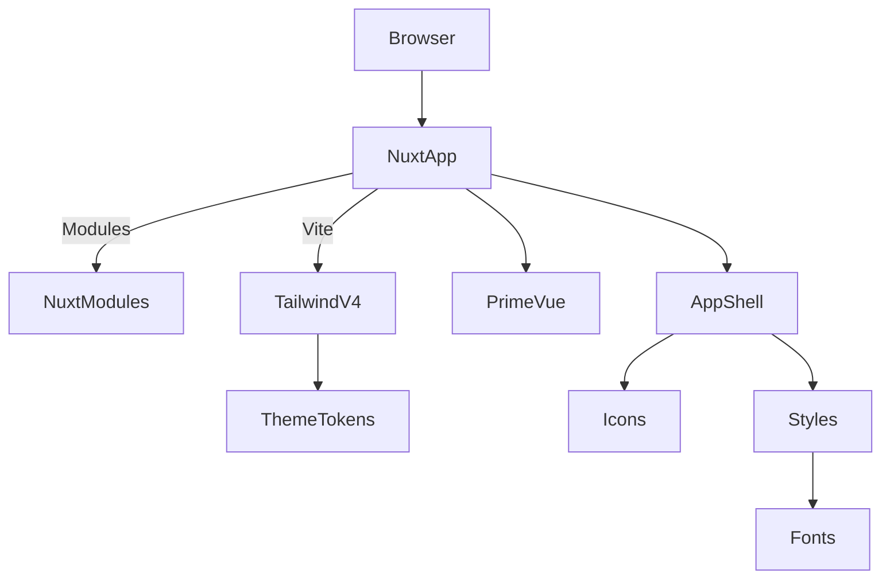

# Kira Starter — Project Overview

## Table of Contents

- [System Summary](#system-summary)
- [Tech Stack](#tech-stack)
- [Entry Points](#entry-points)
- [Subsystems](#subsystems)
- [High-Level Flow](#high-level-flow)
- [Architecture Summary](#architecture-summary)
- [Diagram](#diagram)
- [Glossary](#glossary)

## System Summary

Kira Starter is a minimal Nuxt 4 application focused on a modern, styled frontend. It integrates Tailwind CSS v4 via Vite, PrimeVue (styled mode) for UI components, a semantic theme built with CSS custom properties, DM Sans via Fontsource, anime.js for micro-interactions, and Nuxt modules for icons and images. The current repository contains a single app shell with no backend or persistence.

## Tech Stack

- Framework: Nuxt 4 ([nuxt.config.ts](file:///Users/michaelnji/Projects/kira/nuxt.config.ts#L3-L25))
- UI: Vue 3, Tailwind CSS v4, PrimeVue (styled mode) ([app.vue](file:///Users/michaelnji/Projects/kira/app/app.vue), [primevue.ts](file:///Users/michaelnji/Projects/kira/app/plugins/primevue.ts))
- Modules: @nuxt/fonts, @nuxt/icon, @nuxt/image, @vueuse/nuxt, @formkit/auto-animate/nuxt ([nuxt.config.ts](file:///Users/michaelnji/Projects/kira/nuxt.config.ts#L10-L21))
- Tooling: ESLint (antfu config), Simple Git Hooks, lint-staged ([package.json](file:///Users/michaelnji/Projects/kira/package.json#L5-L52), [eslint.config.mjs](file:///Users/michaelnji/Projects/kira/eslint.config.mjs#L1-L5))

## Entry Points

- Development server: `nuxt dev` ([package.json:scripts](file:///Users/michaelnji/Projects/kira/package.json#L5-L13))
- Build: `nuxt build`, Static generate: `nuxt generate`, Preview: `nuxt preview` ([package.json:scripts](file:///Users/michaelnji/Projects/kira/package.json#L5-L13))
- Application shell: [app.vue](file:///Users/michaelnji/Projects/kira/app/app.vue)
- Global styles and theme: [app.css](file:///Users/michaelnji/Projects/kira/app/assets/css/app.css)

## Subsystems

- App Shell: Composition API setup and hero/feature sections ([app.vue](file:///Users/michaelnji/Projects/kira/app/app.vue#L1-L253))
- UI Components: PrimeVue styled configuration ([primevue.ts](file:///Users/michaelnji/Projects/kira/app/plugins/primevue.ts))
- Micro-interactions: anime.js animations in the app shell ([app.vue](file:///Users/michaelnji/Projects/kira/app/app.vue#L1-L120))
- Fonts: DM Sans via Fontsource imports ([app.css](file:///Users/michaelnji/Projects/kira/app/assets/css/app.css#L1-L6))
- Icons: @nuxt/icon with Solar collection ([nuxt.config.ts](file:///Users/michaelnji/Projects/kira/nuxt.config.ts#L17-L21))
- Images: @nuxt/image (no usage in app shell yet) ([nuxt.config.ts](file:///Users/michaelnji/Projects/kira/nuxt.config.ts#L10-L16))

## High-Level Flow

- The browser loads the Nuxt application.
- Nuxt initializes modules and Vite plugins (Tailwind v4).
- Global CSS establishes fonts and semantic theme variables.
- PrimeVue is initialized via a Nuxt plugin, and the app shell renders UI sections using Tailwind utilities and PrimeVue components.
- The app shell adds subtle entrance reveals and hover micro-interactions using anime.js.

## Architecture Summary

- Client-only Nuxt 4 application with configuration-driven styling.
- No server routes, APIs, or persistence present.
- Modularity via Nuxt modules and CSS plugin-based theming.

## Diagram

## Glossary

- App Shell: Root component that structures the main view.
- PrimeVue (styled): UI component suite themed via `@primeuix/themes` and semantic tokens.
- Vite Plugin: Tool that extends build/dev behavior; here used for Tailwind v4.
- Nuxt Module: Extends Nuxt features (fonts, icons, image, vueuse).
