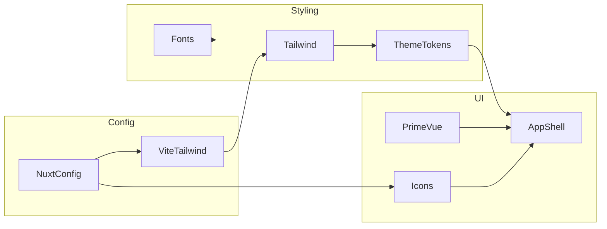

# Architecture

## Table of Contents

- [Overview](#overview)
- [Layers & Responsibilities](#layers--responsibilities)
- [Component Interactions](#component-interactions)
- [Dependencies](#dependencies)
- [Identified Patterns](#identified-patterns)
- [Technical Debt Indicators](#technical-debt-indicators)
- [Scalability Considerations](#scalability-considerations)
- [Diagrams](#diagrams)

## Overview

The repository implements a client-side Nuxt 4 application. Styling and theming are centralized in global CSS using Tailwind v4 and CSS custom properties, while PrimeVue provides UI components in unstyled mode. Nuxt modules provide fonts, icons, and image capabilities. There is currently no backend or persistence layer.

## Layers & Responsibilities

- UI Components: PrimeVue (unstyled) configured via [primevue.ts](file:///Users/michaelnji/Projects/kira/app/plugins/primevue.ts).
- UI Components: PrimeVue (unstyled) configured via [primevue.ts](file:///Users/michaelnji/Projects/kira/plugins/primevue.ts).
- Styling/Theming: [app.css](file:///Users/michaelnji/Projects/kira/app/assets/css/app.css) defines global styles, font-face rules, semantic tokens, and utility classes.
- Configuration: [nuxt.config.ts](file:///Users/michaelnji/Projects/kira/nuxt.config.ts#L3-L25) enables devtools, Tailwind v4 via Vite, and Nuxt modules.

## Component Interactions

- App shell renders content sections and uses Icon components ([app.vue](file:///Users/michaelnji/Projects/kira/app/app.vue)).
- PrimeVue components are imported directly in the app shell; heavier components are lazy-loaded.
- Styles are applied through Tailwind utility classes and semantic CSS variables ([app.vue](file:///Users/michaelnji/Projects/kira/app/app.vue), [app.css](file:///Users/michaelnji/Projects/kira/app/assets/css/app.css)).
- Icon module provides server-side bundled collections (Solar) configured in Nuxt ([nuxt.config.ts](file:///Users/michaelnji/Projects/kira/nuxt.config.ts#L17-L21)).

## Dependencies

- PrimeVue: configured in unstyled mode ([primevue.ts](file:///Users/michaelnji/Projects/kira/app/plugins/primevue.ts)).
- PrimeVue: configured in unstyled mode ([primevue.ts](file:///Users/michaelnji/Projects/kira/plugins/primevue.ts)).
- PrimeIcons: imported globally for component icons ([app.css](file:///Users/michaelnji/Projects/kira/app/assets/css/app.css#L1-L2)).
- Fonts: Local loading via font-face; assets under `public/fonts` referenced from CSS ([app.css](file:///Users/michaelnji/Projects/kira/app/assets/css/app.css#L3-L33)).

## Identified Patterns

- Configuration-as-code: Nuxt modules and Vite plugin declared in [nuxt.config.ts](file:///Users/michaelnji/Projects/kira/nuxt.config.ts#L3-L25).
- Utility-first styling: Tailwind classes drive layout and spacing across the app shell.
- Theme via CSS variables: semantic tokens defined in CSS with `.dark` variants ([app.css](file:///Users/michaelnji/Projects/kira/app/assets/css/app.css#L43-L105)).
- Minimal app shell: No global state management or routing pages are present in the repository.

## Technical Debt Indicators

- Absent pages directory: All content in `app.vue`; page-level routing not yet structured.
- No tests: No test framework or scripts observed.
- Unused modules in UI: @nuxt/image is configured but not used in app shell.

## Scalability Considerations

- Introduce `pages/` and `components/` to structure routing and reusable UI.
- Add state management (Pinia) only when data complexity warrants it.
- Consider extracting theme tokens to dedicated CSS or future Tailwind config when v4 config patterns stabilize.
- Add testing (e.g., Vitest) and CI to ensure quality and consistency.

## Diagrams

