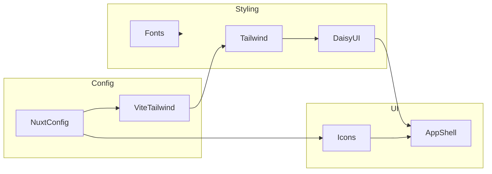

# Architecture

## Table of Contents
- [Overview](#overview)
- [Layers & Responsibilities](#layers--responsibilities)
- [Component Interactions](#component-interactions)
- [Dependencies](#dependencies)
- [Identified Patterns](#identified-patterns)
- [Technical Debt Indicators](#technical-debt-indicators)
- [Scalability Considerations](#scalability-considerations)
- [Diagrams](#diagrams)

## Overview
The repository implements a client-side Nuxt 4 application. Styling and theming are centralized in global CSS using Tailwind v4 and DaisyUI, while Nuxt modules provide fonts, icons, and image capabilities. There is currently no backend or persistence layer.

## Layers & Responsibilities
- Presentation: [app.vue](file:///Users/michaelnji/Projects/kira/app/app.vue#L41-L253) defines the UI structure and sections.
- Styling/Theming: [app.css](file:///Users/michaelnji/Projects/kira/app/assets/css/app.css#L1-L84) defines global styles, font-face rules, and the “kira” DaisyUI theme.
- Configuration: [nuxt.config.ts](file:///Users/michaelnji/Projects/kira/nuxt.config.ts#L3-L25) enables devtools, Tailwind v4 via Vite, and Nuxt modules.
- Tooling: [package.json](file:///Users/michaelnji/Projects/kira/package.json#L5-L13) scripts, [eslint.config.mjs](file:///Users/michaelnji/Projects/kira/eslint.config.mjs#L1-L5), [biome.json](file:///Users/michaelnji/Projects/kira/biome.json#L1-L28) for formatting.

## Component Interactions
- App shell renders content sections and uses Icon components ([app.vue](file:///Users/michaelnji/Projects/kira/app/app.vue#L93-L100)).
- Styles are applied through Tailwind utility classes and DaisyUI component classes ([app.vue](file:///Users/michaelnji/Projects/kira/app/app.vue#L46-L60), [app.css](file:///Users/michaelnji/Projects/kira/app/assets/css/app.css#L82-L84)).
- Icon module provides server-side bundled collections (Solar) configured in Nuxt ([nuxt.config.ts](file:///Users/michaelnji/Projects/kira/nuxt.config.ts#L17-L21)).

## Dependencies
- Tailwind v4 Vite plugin: configured in Nuxt Vite plugins ([nuxt.config.ts](file:///Users/michaelnji/Projects/kira/nuxt.config.ts#L6-L9)).
- DaisyUI theme: enabled via CSS plugin directives ([app.css](file:///Users/michaelnji/Projects/kira/app/assets/css/app.css#L35-L38, L47-L81)).
- Fonts: Local loading via font-face; assets under `public/fonts` referenced from CSS ([app.css](file:///Users/michaelnji/Projects/kira/app/assets/css/app.css#L3-L33)).
- Icons: @nuxt/icon configured with Solar collection ([nuxt.config.ts](file:///Users/michaelnji/Projects/kira/nuxt.config.ts#L17-L21)).

## Identified Patterns
- Configuration-as-code: Nuxt modules and Vite plugin declared in [nuxt.config.ts](file:///Users/michaelnji/Projects/kira/nuxt.config.ts#L3-L25).
- Utility-first styling: Tailwind classes drive layout and spacing across the app shell.
- Theme via CSS variables: DaisyUI theme sets color tokens and radii in CSS ([app.css](file:///Users/michaelnji/Projects/kira/app/assets/css/app.css#L47-L81)).
- Minimal app shell: No global state management or routing pages are present in the repository.

## Technical Debt Indicators
- Absent pages directory: All content in `app.vue`; page-level routing not yet structured.
- No tests: No test framework or scripts observed.
- Unused modules in UI: @nuxt/image is configured but not used in app shell.

## Scalability Considerations
- Introduce `pages/` and `components/` to structure routing and reusable UI.
- Add state management (Pinia) only when data complexity warrants it.
- Consider extracting theme tokens to dedicated CSS or future Tailwind config when v4 config patterns stabilize.
- Add testing (e.g., Vitest) and CI to ensure quality and consistency.

## Diagrams

