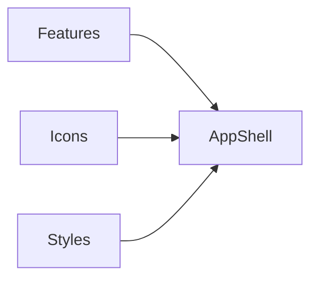

# Module: App Shell

## Table of Contents

- [Purpose](#purpose)
- [Responsibilities](#responsibilities)
- [Key Files](#key-files)
- [Public Interfaces](#public-interfaces)
- [Important Sections](#important-sections)
- [Internal Structure](#internal-structure)
- [Dependencies](#dependencies)
- [Data Usage](#data-usage)
- [Code Examples](#code-examples)
- [Diagram](#diagram)

## Purpose

Render the primary UI for the application using Vue 3 within Nuxt 4.

## Responsibilities

- Display header, hero, feature cards, theme tokens, component showcase, and footer.
- Use PrimeVue (styled mode) components and Tailwind utilities for layout.
- Provide interactive demos (toast, dialog, tabs) with Vue state.
- Use Nuxt Icon for vector icons.
- Add subtle entrance reveals and hover micro-interactions via anime.js.

## Key Files

- [app.vue](file:///Users/michaelnji/Projects/kira/app/app.vue)

## Public Interfaces

- UI rendered at the root route; no exported API beyond the Vue template.

## Important Sections

- Header and theme toggle ([app.vue](file:///Users/michaelnji/Projects/kira/app/app.vue))
- PrimeVue showcase sections (cards, tokens, form, tabs, datatable) ([app.vue](file:///Users/michaelnji/Projects/kira/app/app.vue))
- Dialog + Toast interactions ([app.vue](file:///Users/michaelnji/Projects/kira/app/app.vue))
- Footer ([app.vue](file:///Users/michaelnji/Projects/kira/app/app.vue))

## Internal Structure

- Composition API `script setup` with local state for theme, form inputs, dialog and toast.
- PrimeVue components are imported directly for tree-shaking; heavier ones are lazy-loaded.
- Tailwind utilities drive responsive layout and spacing; semantic theme tokens come from CSS variables.
- Micro-interactions are orchestrated in `onMounted()` with anime.js selectors and `data-*` hooks.

## Dependencies

- @nuxt/icon for Icon components.
- Tailwind v4 for styling.
- PrimeVue (styled mode) for UI components.
- anime.js for micro-interactions.

## Data Usage

- Static feature definitions for display only; no external data or state.

## Code Examples

```vue
<!-- Icon usage within the app shell -->
<Icon name="logos:nuxt-icon" class="text-3xl" />
```

## Diagram


