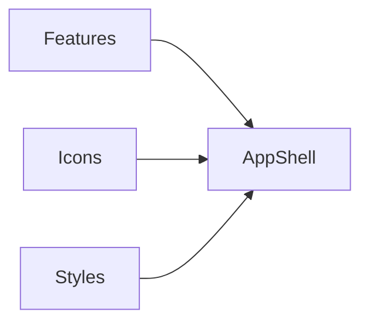

# Module: App Shell

## Table of Contents
- [Purpose](#purpose)
- [Responsibilities](#responsibilities)
- [Key Files](#key-files)
- [Public Interfaces](#public-interfaces)
- [Important Sections](#important-sections)
- [Internal Structure](#internal-structure)
- [Dependencies](#dependencies)
- [Data Usage](#data-usage)
- [Code Examples](#code-examples)
- [Diagram](#diagram)

## Purpose
Render the primary UI for the application using Vue 3 within Nuxt 4.

## Responsibilities
- Display navbar, hero, features, design system showcase, and footer.
- Use Tailwind/DaisyUI classes for layout and components.
- Use Nuxt Icon for vector icons.

## Key Files
- [app.vue](file:///Users/michaelnji/Projects/kira/app/app.vue#L41-L253)

## Public Interfaces
- UI rendered at the root route; no exported API beyond the Vue template.

## Important Sections
- Navbar and actions ([app.vue](file:///Users/michaelnji/Projects/kira/app/app.vue#L45-L60))
- Hero headline and CTA ([app.vue](file:///Users/michaelnji/Projects/kira/app/app.vue#L64-L92))
- Tech icon strip ([app.vue](file:///Users/michaelnji/Projects/kira/app/app.vue#L93-L100))
- Features grid ([app.vue](file:///Users/michaelnji/Projects/kira/app/app.vue#L117-L133))
- Design system: Typography & palette ([app.vue](file:///Users/michaelnji/Projects/kira/app/app.vue#L136-L207))
- Components preview ([app.vue](file:///Users/michaelnji/Projects/kira/app/app.vue#L210-L241))
- Footer ([app.vue](file:///Users/michaelnji/Projects/kira/app/app.vue#L246-L251))

## Internal Structure
- Composition API `script setup` with static `features` list ([app.vue](file:///Users/michaelnji/Projects/kira/app/app.vue#L1-L38)).
- Tailwind/DaisyUI classes drive responsive layout and UI components.

## Dependencies
- @nuxt/icon for Icon components.
- Tailwind v4 and DaisyUI for styling.

## Data Usage
- Static feature definitions for display only; no external data or state.

## Code Examples
```vue
<!-- Icon usage within the app shell -->
<Icon name="logos:nuxt-icon" class="text-3xl" />
```

## Diagram


