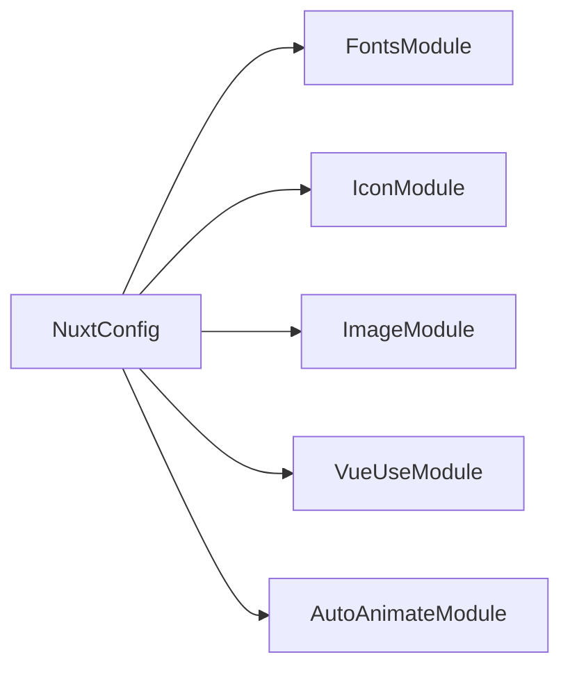

# Module: Nuxt Modules

## Table of Contents
- [Purpose](#purpose)
- [Installed Modules](#installed-modules)
- [Key Files](#key-files)
- [Public Interfaces](#public-interfaces)
- [Dependencies & Configuration](#dependencies--configuration)
- [Usage Notes](#usage-notes)
- [Diagram](#diagram)

## Purpose
Extend Nuxt functionality for fonts, icons, images, utilities, and animations.

## Installed Modules
- `@nuxt/fonts` — Local font loading ([nuxt.config.ts](file:///Users/michaelnji/Projects/kira/nuxt.config.ts#L10-L16))
- `@nuxt/icon` — Icon component with bundled collections ([nuxt.config.ts](file:///Users/michaelnji/Projects/kira/nuxt.config.ts#L17-L21))
- `@nuxt/image` — Optimized image handling ([nuxt.config.ts](file:///Users/michaelnji/Projects/kira/nuxt.config.ts#L10-L16))
- `@vueuse/nuxt` — VueUse composables integration ([nuxt.config.ts](file:///Users/michaelnji/Projects/kira/nuxt.config.ts#L10-L16))
- `@formkit/auto-animate/nuxt` — Minimal animations for DOM changes ([nuxt.config.ts](file:///Users/michaelnji/Projects/kira/nuxt.config.ts#L10-L16))

## Key Files
- Configuration: [nuxt.config.ts](file:///Users/michaelnji/Projects/kira/nuxt.config.ts#L10-L25)
- App usage: [app.vue](file:///Users/michaelnji/Projects/kira/app/app.vue#L93-L100) for icons

## Public Interfaces
- Icon component `<Icon name="..." />` is available globally when using `@nuxt/icon`.
- Image components from `@nuxt/image` available for optimized images (not used yet).

## Dependencies & Configuration
- Icons: `icon.serverBundle.collections: ["solar"]` ([nuxt.config.ts](file:///Users/michaelnji/Projects/kira/nuxt.config.ts#L17-L21))
- Fonts: `fonts.provider: "local"` ([nuxt.config.ts](file:///Users/michaelnji/Projects/kira/nuxt.config.ts#L22-L24))

## Usage Notes
- Modules are configured but some (image, vueuse, auto-animate) are not explicitly used in the app shell yet.

## Diagram

