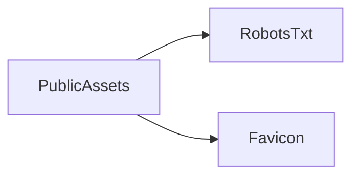

# Module: Public Assets

## Table of Contents

- [Purpose](#purpose)
- [Responsibilities](#responsibilities)
- [Key Files](#key-files)
- [Public Interfaces](#public-interfaces)
- [Dependencies](#dependencies)
- [Code Examples](#code-examples)
- [Diagram](#diagram)

## Purpose

Provide static assets (favicon, robots) served directly by the Nuxt app.

## Responsibilities

- Provide site metadata assets (favicon, robots).

## Key Files

- [public/robots.txt](file:///Users/michaelnji/Projects/kira/public/robots.txt#L1-L2)
- `public/favicon.ico`

## Public Interfaces

- Assets available under `/` path (e.g., `/robots.txt`, `/favicon.ico`).

## Dependencies

- No runtime JS dependencies; these files are served statically by Nuxt.

## Code Examples

```txt
User-Agent: *
Disallow:
```

## Diagram


