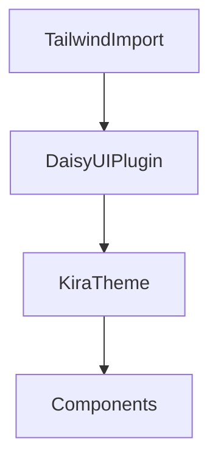

# Module: Styling & Theme

## Table of Contents
- [Purpose](#purpose)
- [Responsibilities](#responsibilities)
- [Key Files](#key-files)
- [Public Interfaces](#public-interfaces)
- [Important Rules](#important-rules)
- [Internal Structure](#internal-structure)
- [Dependencies](#dependencies)
- [Code Examples](#code-examples)
- [Diagram](#diagram)

## Purpose
Provide global styling, fonts, and a coherent theme using Tailwind CSS v4 and DaisyUI.

## Responsibilities
- Import Tailwind v4 globally.
- Register local fonts via `@font-face`.
- Define and activate the "kira" DaisyUI theme.
- Apply common component styles.

## Key Files
- [app.css](file:///Users/michaelnji/Projects/kira/app/assets/css/app.css#L1-L84)

## Public Interfaces
- Global CSS applied to all pages/components via Nuxt `css` entry ([nuxt.config.ts](file:///Users/michaelnji/Projects/kira/nuxt.config.ts#L9-L9)).

## Important Rules
- Font-face for General Sans and Gambetta ([app.css](file:///Users/michaelnji/Projects/kira/app/assets/css/app.css#L3-L33)).
- DaisyUI plugin activation and theme declaration ([app.css](file:///Users/michaelnji/Projects/kira/app/assets/css/app.css#L35-L38, L47-L81)).
- Button font weight tweak ([app.css](file:///Users/michaelnji/Projects/kira/app/assets/css/app.css#L82-L84)).

## Internal Structure
- Tailwind v4 imported via CSS `@import "tailwindcss";` ([app.css](file:///Users/michaelnji/Projects/kira/app/assets/css/app.css#L1-L1)).
- Theme tokens defined with CSS custom properties under the DaisyUI theme block.

## Dependencies
- Tailwind v4 (via Vite plugin) ([nuxt.config.ts](file:///Users/michaelnji/Projects/kira/nuxt.config.ts#L6-L9)).
- DaisyUI CSS plugin and theme module.

## Code Examples
```css
@plugin "daisyui" {
  themes: kira;
  logs: true;
}

@plugin "daisyui/theme" {
  name: "kira";
  default: true;
  /* tokens omitted */
}
```

## Diagram


