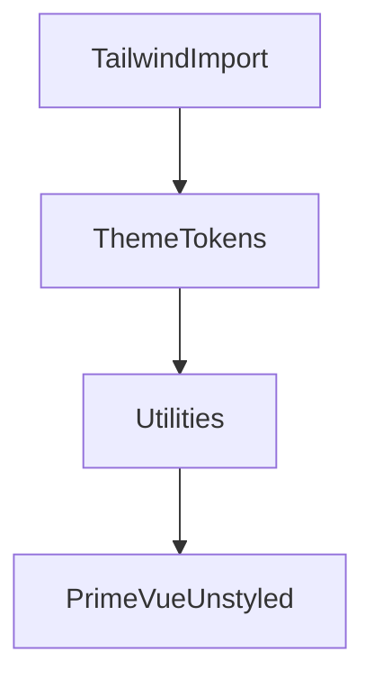

# Module: Styling & Theme

## Table of Contents

- [Purpose](#purpose)
- [Responsibilities](#responsibilities)
- [Key Files](#key-files)
- [Public Interfaces](#public-interfaces)
- [Important Rules](#important-rules)
- [Internal Structure](#internal-structure)
- [Dependencies](#dependencies)
- [Code Examples](#code-examples)
- [Diagram](#diagram)

## Purpose

Provide global styling, fonts, and a coherent theme using Tailwind CSS v4 and CSS custom properties.

## Responsibilities

- Import Tailwind v4 globally.
- Register local fonts via `@font-face`.
- Define semantic theme tokens using CSS custom properties with light/dark variants.
- Provide utility classes for common UI patterns used with PrimeVue unstyled components.

## Key Files

- [app.css](file:///Users/michaelnji/Projects/kira/app/assets/css/app.css#L1-L84)

## Public Interfaces

- Global CSS applied to all pages/components via Nuxt `css` entry ([nuxt.config.ts](file:///Users/michaelnji/Projects/kira/nuxt.config.ts#L9-L9)).

## Important Rules

- Font-face for General Sans and Gambetta ([app.css](file:///Users/michaelnji/Projects/kira/app/assets/css/app.css#L3-L33)).
- PrimeIcons CSS import for PrimeVue icons ([app.css](file:///Users/michaelnji/Projects/kira/app/assets/css/app.css#L1-L2)).
- Semantic tokens and dark mode variants ([app.css](file:///Users/michaelnji/Projects/kira/app/assets/css/app.css#L43-L105)).
- Common utility classes (`.k-btn`, `.k-card`, `.k-input`, `.k-badge`) ([app.css](file:///Users/michaelnji/Projects/kira/app/assets/css/app.css#L107-L135)).

## Internal Structure

- Tailwind v4 imported via CSS `@import 'tailwindcss';` ([app.css](file:///Users/michaelnji/Projects/kira/app/assets/css/app.css#L1-L1)).
- Theme tokens defined with CSS custom properties in `:root` and `.dark`.

## Dependencies

- Tailwind v4 (via Vite plugin) ([nuxt.config.ts](file:///Users/michaelnji/Projects/kira/nuxt.config.ts#L6-L9)).
- PrimeIcons (icons used by PrimeVue) imported in global CSS ([app.css](file:///Users/michaelnji/Projects/kira/app/assets/css/app.css#L1-L2)).

## Code Examples

```css
:root {
  --color-primary: #2563eb;
  --color-secondary: #4b5563;
  --color-accent: #9333ea;
  --color-neutral: #6b7280;
  --color-info: #0ea5e9;
  --color-success: #22c55e;
  --color-warning: #f59e0b;
  --color-error: #ef4444;
}

.dark {
  --color-primary: #60a5fa;
  /* other tokens omitted */
}
```

## Diagram


